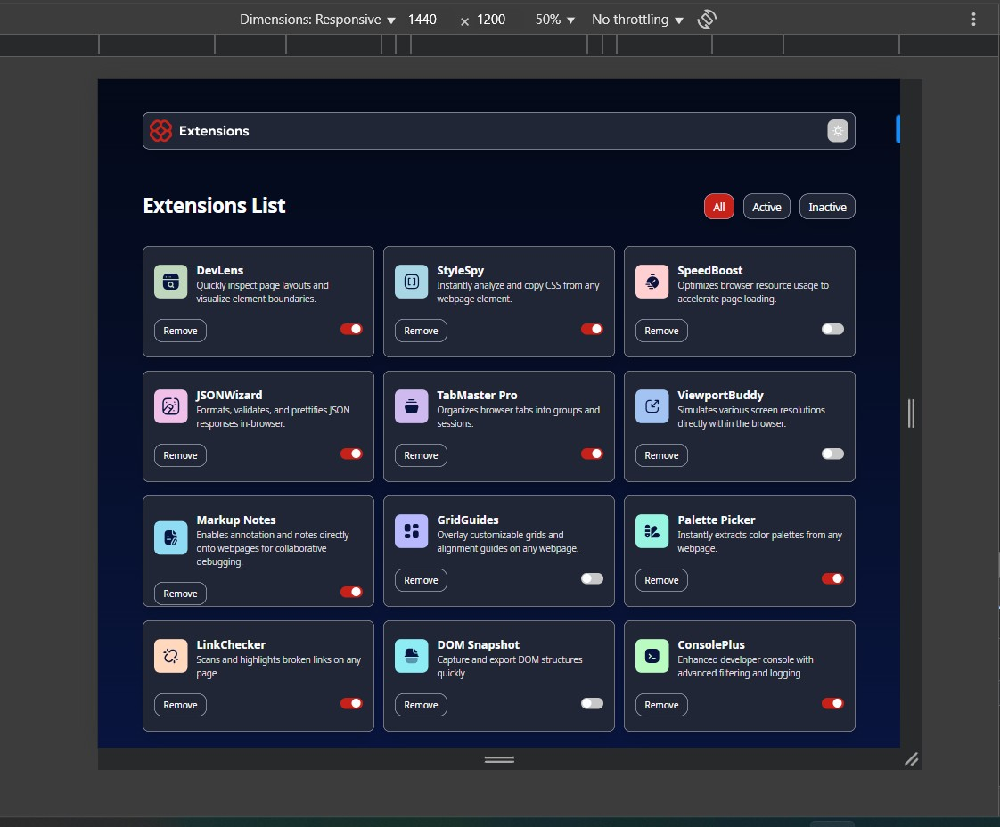

# Frontend Mentor - Browser extensions manager UI solution


This is a solution to the [Browser extensions manager UI challenge on Frontend Mentor](https://www.frontendmentor.io/challenges/browser-extension-manager-ui-yNZnOfsMAp).

## Table of contents

- [Overview](#overview)
  - [The challenge](#the-challenge)
  - [Screenshot](#screenshot)
  - [Links](#links)
- [My process](#my-process)
  - [Built with](#built-with)
  - [What I learned](#what-i-learned)
  - [Continued development](#continued-development)
  - [Useful resources](#useful-resources)
- [Author](#author)
- [Acknowledgments](#acknowledgments)

**Note: Delete this note and update the table of contents based on what sections you keep.**

## Overview

The Extension Dashboard is a responsive, dynamic web application built using Angular and Tailwind CSS, designed to showcase and manage a curated list of browser extensions. The interface allows users to seamlessly filter, view, and interact with extension cards in a modern, dark-mode friendly UI.

### The challenge

Users should be able to:

- Toggle extensions between active and inactive states
- Filter active and inactive extensions
- Remove extensions from the list
- Select their color theme
- View the optimal layout for the interface depending on their device's screen size
- See hover and focus states for all interactive elements on the page

### Screenshot



### Links

- Solution URL: [Add solution URL here](https://your-solution-url.com)
- Live Site URL: [Add live site URL here](https://your-live-site-url.com)

## My process

### Built with

- Semantic HTML5 markup
- Tailwind CSS v4 custom properties
- Flexbox
- CSS Grid
- Mobile-first workflow
- Reactive Data Flow through immutable updates and proper tracking with trackBy
- [Angular 17+](https://angular.dev/) - used standalone components and control flow syntax
- [Tailwind css](https://tailwindcss.com/) - for utility-first, responsive styling

### What I learned

Using tailwind css for dynamic theming and integrating with angular

```html
<button [class.active]="selectedIndex === $index" (click)="onPillBtnClick($index)">{{btn}}/></button>
```

setting dark active and active class for theming with Tailwind.

```css
@custom-variant active (&:where(.active, .active *));
@custom-variant dark-active (&:where(.dark.active, .dark.active *, .dark .active, .dark .active *));
```

```js
const proudOfThisFunc = () => {
  console.log("🎉");
};
```

### Continued development

Future development of the Extension Dashboard will focus on enhancing interactivity, accessibility, and scalability. Key areas include:

- **Persistent State Management**: Store user changes locally or integrate with backend services for long-term state retention.
- **Search and Tagging**: Implement search input and advanced filters to improve discoverability.
- **Animations & Transitions**: Improve visual flow with Angular animations for card entry/removal.
- **Unit & Integration Testing**: Expand test coverage to ensure stability and reliability.
- **Backend Integration**: Prepare for API connectivity to support real-time data updates and centralized extension management.

These improvements aim to evolve the project into a production-ready, extensible interface suitable for both local and cloud-based use cases.

### Useful resources

- [Example resource 1](https://www.example.com) - This helped me for XYZ reason. I really liked this pattern and will use it going forward.
- [Example resource 2](https://www.example.com) - This is an amazing article which helped me finally understand XYZ. I'd recommend it to anyone still learning this concept.

**Note: Delete this note and replace the list above with resources that helped you during the challenge. These could come in handy for anyone viewing your solution or for yourself when you look back on this project in the future.**

## Author

- Website - [Add your name here](https://www.your-site.com)
- Frontend Mentor - [@yourusername](https://www.frontendmentor.io/profile/yourusername)
- Twitter - [@yourusername](https://www.twitter.com/yourusername)

**Note: Delete this note and add/remove/edit lines above based on what links you'd like to share.**

## Acknowledgments

This is where you can give a hat tip to anyone who helped you out on this project. Perhaps you worked in a team or got some inspiration from someone else's solution. This is the perfect place to give them some credit.

**Note: Delete this note and edit this section's content as necessary. If you completed this challenge by yourself, feel free to delete this section entirely.**
